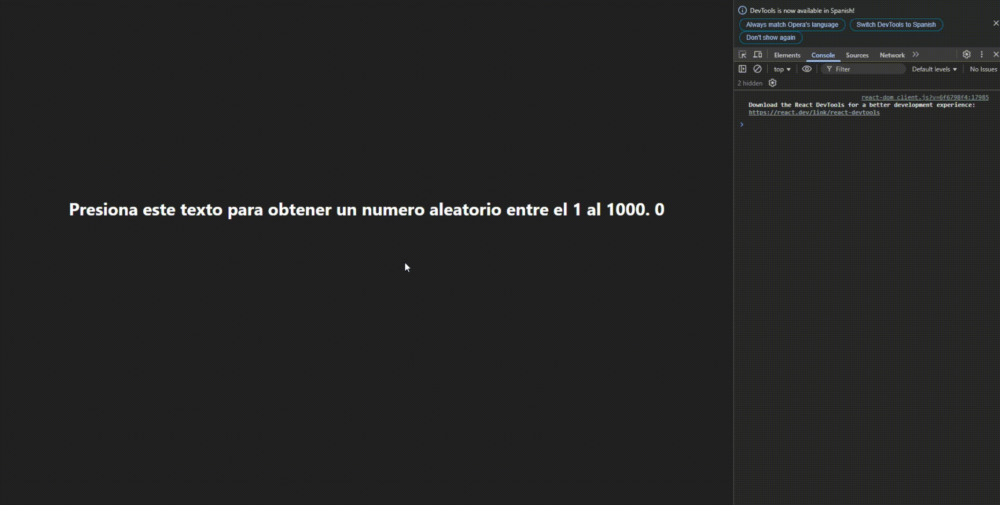
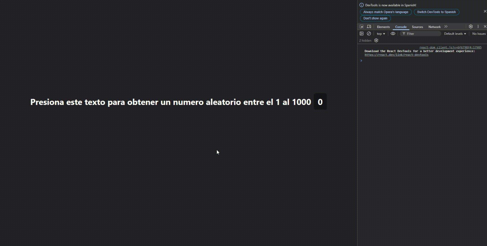

# Frontend - UseState

## Ejercicio 2:
Crear un componente en React que posea un h1 que al hacerle click se obtenga y muestre un número aleatorio entre el 1 y el 1000.

### <strong>Explicación</strong>
### ¿Qué es el UseState?
Para entender qué es el UseState primero debemos saber que pasa si hacemos este ejercicio sin usar el UseState:
* Teniendo en App esto:
```js
function App() {
    return(
        <RandomNumber />
    )
}
```

* Teniendo en el componente RandomNumber esto sin usar UseState:
```jsx
function RandomNumber(){
    let number = 0;

    function handleClick(e){
        e.preventDefault();
        number = Math.floor(Math.random() * 1000 + 1);
        console.log(number); // Ahora vas a ver para qué nos fijamos en consola.
    }
    
    return(
        <h1>{number}</h1>
    )
}

export default RandomNumber;
```

El resultado:



Como se puede notar acá, tenemos un problema. Y dirán está todo bien puesto, ¿cómo puede andar mal si hasta está puesto el `event` en el handler para que no se recargue la página? Bueno, en React los eventos funcionan distinto. Se puede ver que cada vez que se le hace click al h1 se debería actualizar el número mostrado en pantalla pero aún así no se renderiza porque React no sabe que se actualizó. Y en la consola al no ser parte del DOM virtual, sí se muestran los nuevos valores que puede tomar el número al hacer click en el elemento h1.

Entonces, si asignamos a las variables de la forma tradicional, React no va a poder saber cuándo algo cambió para poder actualizar su interfaz (su DOM virtual). Para eso se utiliza el `hook` `UseState` y se expresa de la siguiente forma:

```jsx
import { useState } from 'react';

function RandomNumber(){
    const [number, setNumber] = useState(0);
    function handleClick(){
        const n = Math.floor(Math.random() * 1000 + 1);
        setNumber(n);
        console.log(n);
    }
    

    return(
        <>
            <h1 onClick={handleClick}>Presiona este texto para obtener un numero aleatorio entre el 1 al 1000<span>{number}</span></h1>
        </>
    )
}

export default RandomNumber;
```
## Siendo los pasos a seguir para agregar estado a las variables son estos:
1. Primero se importa el `hook` `UseState` de React.
2. Dentro del componente, se va a declarar lo siguiente: `const [number, setNumber] = useState(0);` ----> [Click acá si querés saber una curiosidad](#curiosidad).
   *   `number` va a ser aquel valor que se va a actualizar y mostrar o renderizar en pantalla.
   *   `setNumber` va a ser aquella función que se encarga de actualizar el valor de `number`, es decir que le asigna el estado.
   *   `useState(0)` es donde se asigna es el valor inicial a la variable de estado, o sea a `number`. En este caso 0 sería el valor inicial.
3. En el ejemplo quizá no se puede ver muy bien pero dentro del `handlerClick` se pasa el valor aleatorio de `Math.floor(Math.random() * 1000 + 1)` de forma indirecta a la variable `number` con `setNumber`.
4. En el `return` se muestra en pantalla con el h1 el valor del número aleatorio.

El resultado es este:



Se puede ver que la cosa cambia y el número no deja de actualizarse en pantalla con cada click.

## Curiosidad
También el useState se puede declarar de esta forma:

```jsx
const numberState = useState(0); // numberState es el array que contiene el number y al setNumber y toma los valores de la función useState creada por React para manejar el estado y se indica el valor inicial 

const number = numberState[0]; // numberState[0] es el número

const setNumber = numberState[1]; // numberState[1] es la función que actualiza al number, o sea el setNumber

```
Cabe aclarar que es de buen hábito para más legibilidad utilizar:
```jsx
const [number, setNumber] = useState(0);
```

Y (obviamente) en ambos casos se puede hacer esto:

```jsx
setNumber(777); // Actualizamos el number con el setNumber para que en el futuro se muestre en pantalla el número actualizado.
```